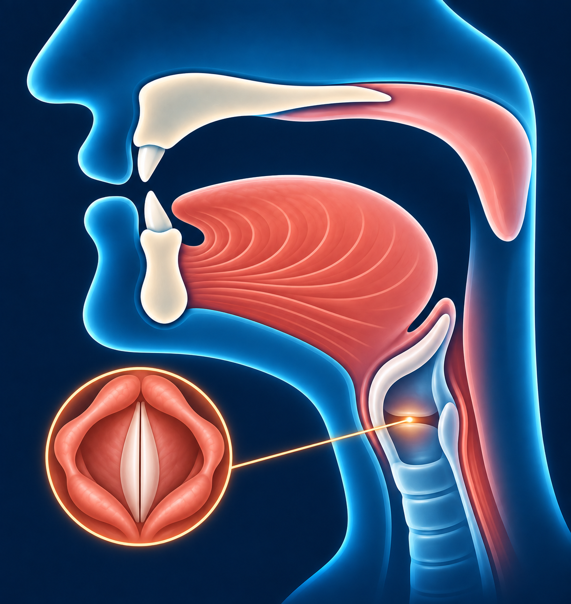

# Алиф — ا

С гласным «а» **أَ** звучит как короткое, чёткое **«а»**
в начале слова «арбуз».

## Как пишется

**ا** — вертикальная черта без точек. Пишите её сверху вниз.
В сочетании **أ** над чертой добавляется маленький знак **ء**.

## Махрадж — как произнести

Звук образуется глубоко в горле. Скажите отчётливое «а»,
как будто начинаете слово после паузы. В самом начале горло
на мгновение закрывается и сразу открывается.

## Сыфат — как звучит

**ء** произносится чётко, без придыхания. Сама хамза не тянется.

**Примечание:** в **أ** этот звук даёт **хамза — ء**.
Сам **ا** используется для удлинения «а». Разницу разберём позже.
