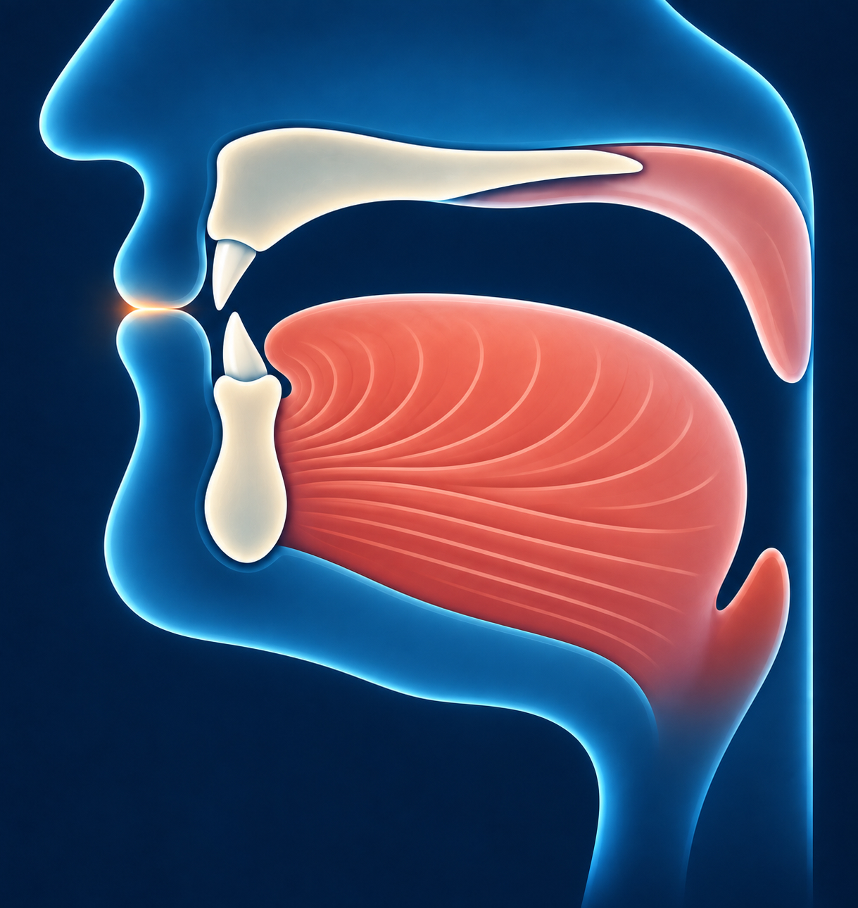

# Ба — ب

Звучит похоже на русское **«б»**.

## Как пишется

Ба похожа на неглубокую чашу с одной точкой снизу.

## Как произнести

Сомкните губы, затем разомкните их со звуком «б». Это и есть махрадж ба —
две губы. [Источник](https://tajweed.quranpedia.net/lessons/show/content/18).

## Как звучит

Ба произносится с голосом. Скажите «ба». Сначала губы сомкнуты, затем
открываются: получается «б», а за ним — «а». Если произнести «ба-а-а»,
тянется только «а». Сам звук «б» остаётся коротким.
[Свойства звука](https://tajweed.quranpedia.net/lessons/show/content/19).
