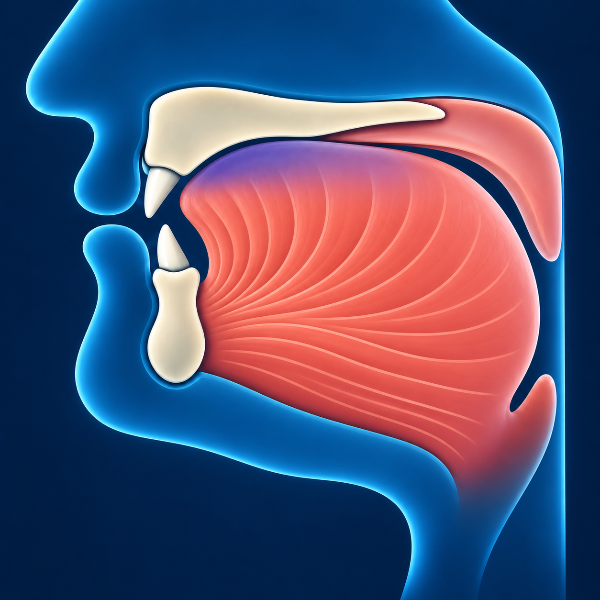

# Дод — ض

В русском языке точного аналога нет. На слух **ض** напоминает
глубокое **«д» с объёмным звучанием**.

## Как пишется

По форме такая же, как **ص**, но с **одной точкой сверху**.

## Махрадж — как произнести

Прижмите боковые края языка к верхним коренным зубам — большим зубам
в глубине рта.

Основное давление приходится на бок языка. Если произносить звук
только кончиком, как русское «д», получится другая буква – даль.

## Сыфат — как звучит

**ض** произносится с голосом и **объёмным звучанием**: задняя часть
языка поднимается, и звук становится глубже. 

У **ض** объёмное звучание выражено сильно. Поэтому **ضَ** на слух
напоминает «до»: гласный «а» приобретает выраженный оттенок «о».
Округлять губы, как для русского «о», не нужно.

**Попробуйте:** послушайте произношение **ض** и повторите,
сохраняя это положение языка.
