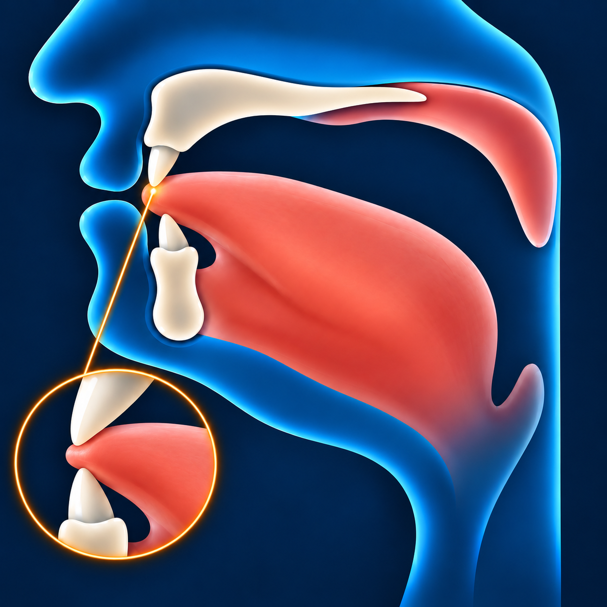

# Заль — ذ

Звучит похоже на **«з», произнесённое с кончиком языка между зубами**.

**ذ** — межзубная буква, как и **ث**: кончик языка немного выступает
между зубами.

## Как пишется

По форме такая же, как **د**, но с **одной точкой сверху**.

## Махрадж — как произнести

Слегка высуньте кончик языка между зубами и коснитесь им края верхних
передних зубов. Попробуйте произнести «з» в этом положении.
Не зажимайте язык: воздух должен проходить.

**Обратите внимание:** у **ذ** положение языка такое же, как у **ث**,
но **ذ** произносится с голосом.
