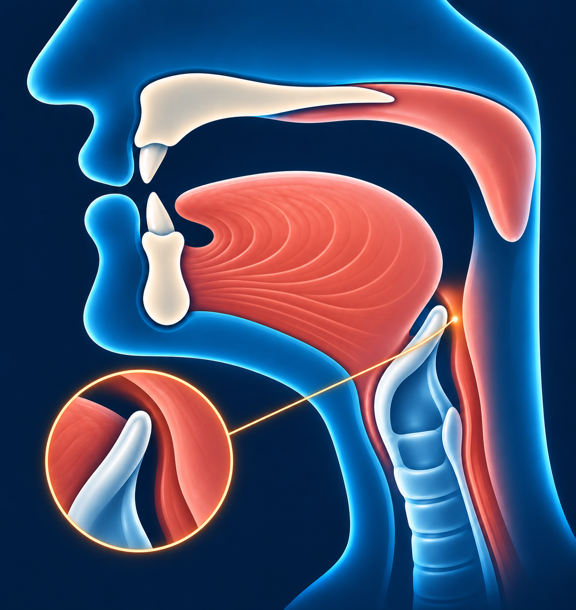

# Ха — ح

В русском языке такого звука нет. Он напоминает **слышный выдох из горла**.

## Как пишется

По форме такая же, как **ج**, но **без точки**.

## Махрадж — как произнести

Звук образуется в середине горла. Откройте рот и плавно выдохните,
слегка сужая проход в горле, чтобы стал слышен шум воздуха.
Язык не прижимайте к нёбу и не сдавливайте горло с силой.

## Сыфат — как звучит

Звук **ح** произносится без голоса — слышен только шум выдоха.
Воздух идёт непрерывно, поэтому звук можно тянуть.
