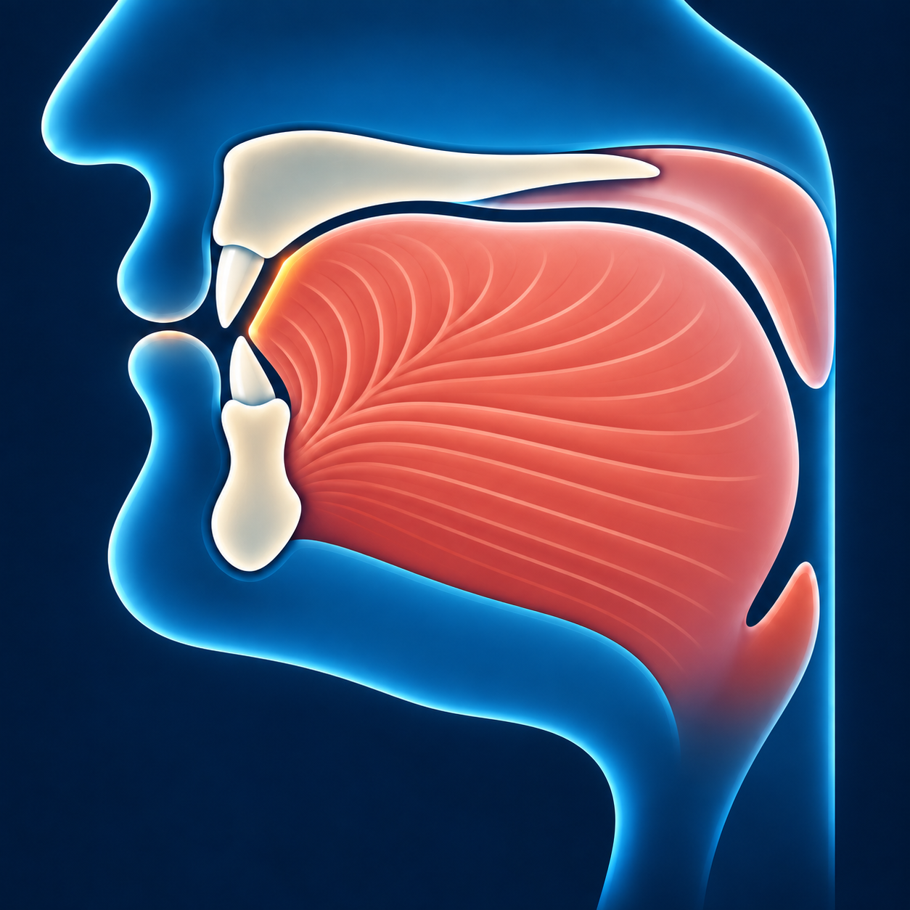

# Сод — ص

Звучит похоже на **«с» с объёмным звучанием** — глубже, чем **س**.

## Как пишется

У **ص** вытянутая петля, маленький зубец и округлая часть,
похожая на чашу. **Точек нет**.

## Махрадж — как произнести

Приподнимите заднюю часть языка к нёбу и произнесите «с»,
оставляя щель для воздуха. 

## Сыфат — как звучит

**ص** — буква с **объёмным звучанием**: задняя часть языка поднимается,
и звук становится глубже. Говорить громче для этого не нужно.

**ص** произносится без голоса, со свистящим оттенком.
Звук можно плавно тянуть.
