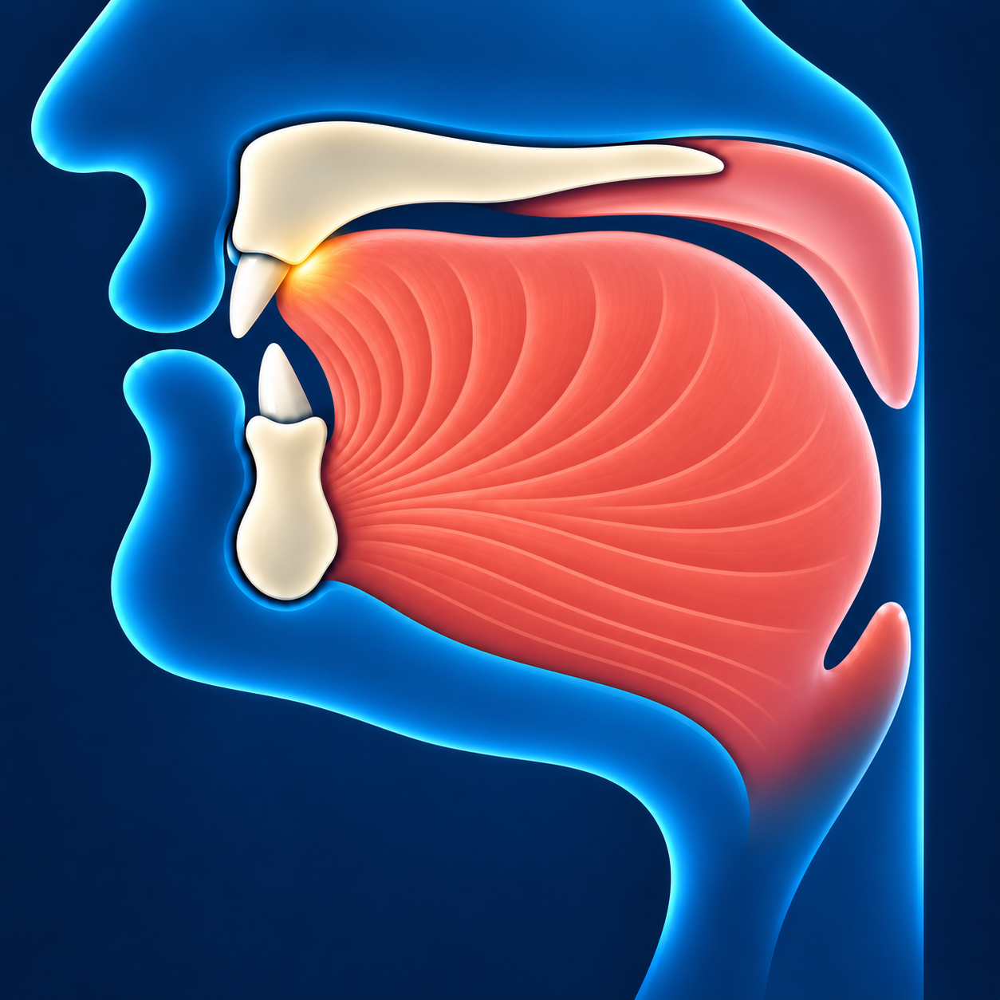

# Та — ط

Звучит похоже на **«т» с объёмным звучанием** — твёрже, чем **ت**.

## Как пишется

У **ط** овальная петля и высокая вертикальная черта. **Точек нет**.

## Махрадж — как произнести

Прижмите кончик языка к нёбу сразу за верхними передними зубами,
как для **ت**. Приподнимите заднюю часть языка и произнесите «т».

## Сыфат — как звучит

**ط** — буква с **объёмным звучанием**: задняя часть языка поднимается,
и звук становится более твёрдым. Говорить громче для этого не нужно.

Сам звук **ط** короткий: его не тянут.
