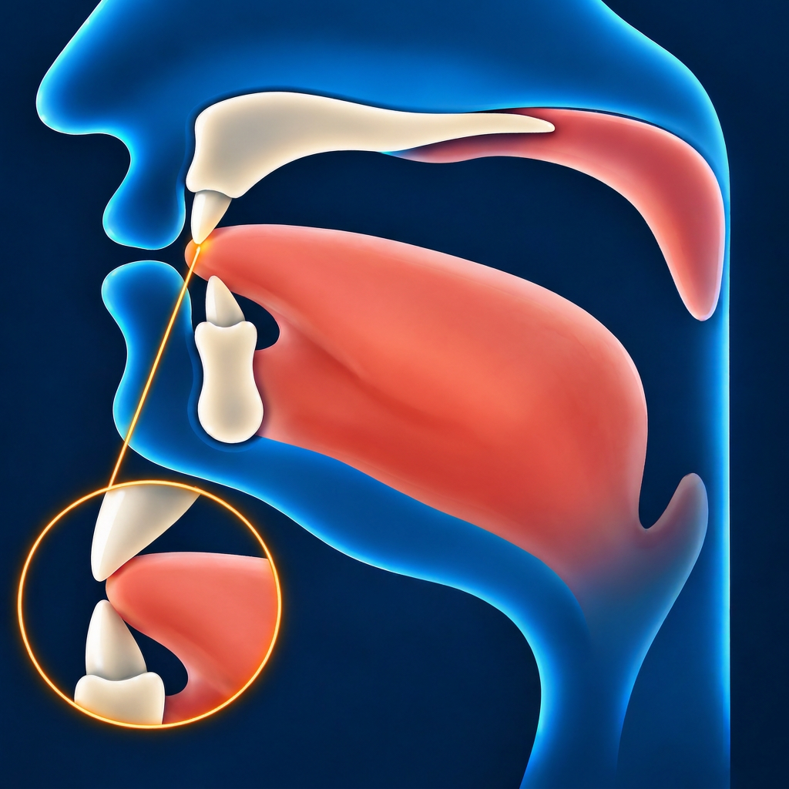

# Са — ث

Звучит похоже на **«с», произнесённое с кончиком языка между зубами**.

**ث** — **межзубная буква**: при её произнесении кончик языка немного
выступает между зубами.

## Как пишется

По форме такая же, как **ت**, но сверху **три точки**.

## Махрадж — как произнести

Слегка высуньте кончик языка между зубами и коснитесь им края верхних
передних зубов. Попробуйте произнести «с» в этом положении, плавно
выпуская воздух. Не зажимайте язык.

## Сыфат — как звучит

**ث** произносится без голоса — слышен только шум воздуха. Звук можно плавно
тянуть, пока идёт выдох.
