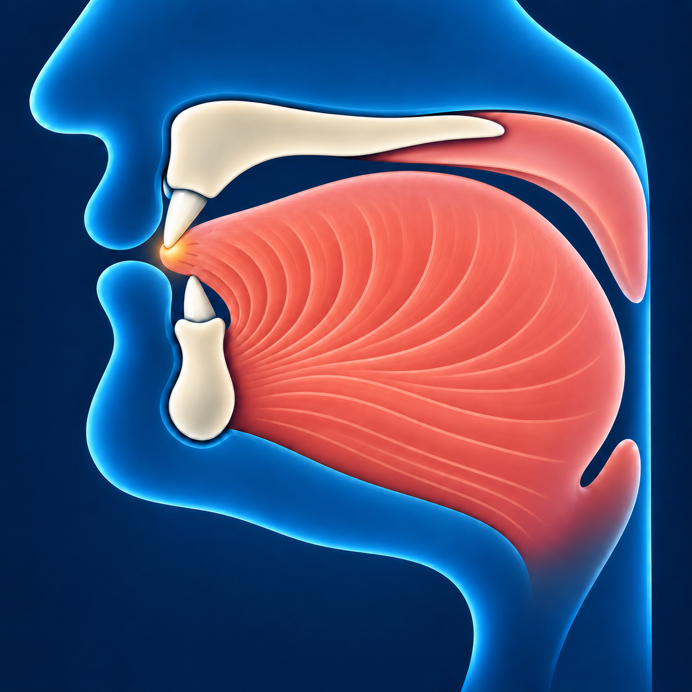

# За — ظ

Звучит похоже на **межзубное «з» с объёмным звучанием** — твёрже, чем **ذ**.

## Как пишется

По форме такая же, как **ط**, но с **одной точкой сверху**.

## Махрадж — как произнести

**ظ** — **межзубная буква**: кончик языка немного выступает между зубами.
Коснитесь им края верхних передних зубов, как для **ذ**.
Приподнимите заднюю часть языка и попробуйте произнести «з» в этом положении.
Не зажимайте язык: воздух должен проходить.

## Сыфат — как звучит

**ظ** произносится с голосом и **объёмным звучанием**: задняя часть языка
поднимается, и звук становится более твёрдым. Говорить громче не нужно.

Звук можно плавно тянуть.
